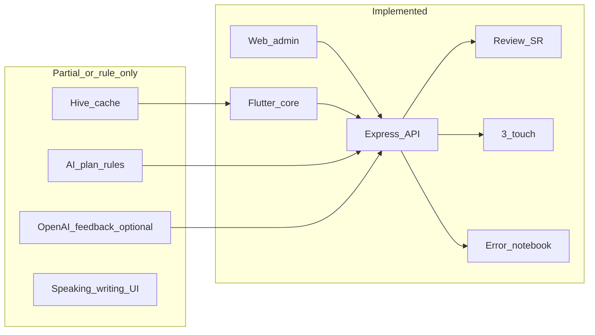

# So sánh tài liệu `doc/` với codebase MY LEARN E

Tài liệu này đối chiếu các mô tả trong thư mục `doc/` với trạng thái thực tế của monorepo (backend, web-admin, mobile-app, database).

**Nguồn tham chiếu trong `doc/`:**  
[MY LEARN E open-source personal project.md](MY%20LEARN%20E%20open-source%20personal%20project.md),  
[kế hoạch dự án app học tiếng Anh cá nhân.md](kế%20hoạch%20dự%20án%20app%20học%20tiếng%20Anh%20cá%20nhân.md),  
[FULL EXPRESS BACKEND.md](FULL%20EXPRESS%20BACKEND.md),  
[FULL DATABASE PRODUCTION VERSION.md](FULL%20DATABASE%20PRODUCTION%20VERSION.md),  
[REVIEW ENGINE như Anki + Quizlet nhưng tối ưu cho người Việt.md](REVIEW%20ENGINE%20như%20Anki%20%2B%20Quizlet%20nhưng%20tối%20ưu%20cho%20người%20Việt.md),  
[FULL AI PERSONAL LEARNING ENGINE.md](FULL%20AI%20PERSONAL%20LEARNING%20ENGINE.md),  
[FULL REACT ADMIN UI production.md](FULL%20REACT%20ADMIN%20UI%20production.md),  
[FULL MOBILE LEARNING FLOW bằng Flutter.md](FULL%20MOBILE%20LEARNING%20FLOW%20bằng%20Flutter.md).

**Đối chiếu chính với code:** `backend/src/app.js`, routes/services/models, `database/migrations`, `web-admin/src`, `mobile-app/lib`.

---

## Đã có (đã có trong code, có thể dùng được)

### Nền tảng và API

- Express + Sequelize + MySQL; cấu trúc controller → service → repository.
- JWT auth; các route học tập dùng `authMiddleware` (`backend/src/app.js`).
- OpenAPI/Swagger tại `/api/docs` và `/api/openapi.json`.
- Health check `/health`.

### Từ vựng và nội dung

- CRUD vocabulary, gắn topic qua `topic_ids`; API collocations và word-family theo `vocabulary/:id` (`backend/src/routes/vocabulary.route.js`).
- CRUD topics (`/api/topics`).
- **`GET /api/topics/today`** — snapshot “nhiệm vụ hôm nay” (gộp rule-based plan + số review đến hạn + top errors); dùng chung cho mobile home/topic (`backend/src/routes/topic.route.js`, `backend/src/services/topic.service.js`).

### Review engine (lõi)

- `GET /api/review/today`, `POST /api/review/submit` với rating Again/Hard/Good/Easy, ease factor, thời gian phản hồi; bảng `review_progress`, `review_history` (`backend/src/constants/review.constants.js`, `backend/src/services/review.service.js`).
- Khoảng cách base 1→120 ngày khớp spec review engine trong doc.

### 3-touch

- `GET/PATCH /api/review/touch/:wordId` và luồng 3 bước trên mobile (`backend/src/routes/review.route.js`, `mobile-app/lib/screens/review/review_screen.dart`).

### Error notebook

- API lỗi + top repeated; tags (migration `add-error-tags`).

### Hoạt động và ưu tiên

- Streak + heatmap API và trang admin (`web-admin/src/pages/StreakPage.jsx`).
- Weak words, confusion pairs (dùng trong AI plan) — theo services/repositories hiện có.
- Cron `node-cron` sinh `daily_review_queue` hằng ngày (`backend/src/jobs/review.job.js`, `backend/src/server.js`).

### AI / engine (rule-based, không LLM)

- `POST /api/ai/generate-today-plan` — kế hoạch ngày bằng rule engine (`meta.llm: false` trong `backend/src/ai/plan-generator.js`).

### Ghi nhận speaking / writing / feedback

- API `speaking-records`, `writing-records`, `ai/feedback` (lưu bản ghi).
- **Tùy chọn LLM:** `POST /api/ai/feedback` với `generate_llm: true` và `learner_text` gọi OpenAI khi có `OPENAI_API_KEY` (`backend/src/services/ai-feedback.service.js`, `backend/src/utils/openai-llm.js`).

### Web admin

- Login, Dashboard (số liệu cơ bản), Vocabulary (**Import CSV** + **Export CSV** — `web-admin/src/pages/VocabularyPage.jsx`), Review, Errors, Topics, Streak, Phase K (speaking/writing/feedback).

### Mobile

- Splash, login, home “Today Mission” (**bind `GET /api/topics/today`** qua `TodayMissionService`), màn topic động, **browse vocabulary** (`/vocabulary`), **chi tiết từ** (collocations/word-family qua API), **streak + heatmap** (`streak_screen.dart`), review + 3-touch (**PageView** + thanh Again–Easy), **tap-to-flip** trên thẻ ôn (`review_flashcard.dart`), error notebook, daily summary (Phase K), profile; Hive cache (`cache_service.dart`); stub FCM / offline nâng cấp dần (`push_reminders_stub.dart` hoặc FCM thật, `offline_sync_service.dart`).

### CSDL

- Migration phase B + collocations/word-family, error tags, streak, weak words, speaking/writing/ai_feedback, review_history `selected_word_id`, **`ai_error_patterns`** + cột **`fake_known_count`** trên `review_progress` — xem `database/migrations/` và [AUDIT_DB_VS_DOC.md](AUDIT_DB_VS_DOC.md).

---

## Chưa có hoặc mới một phần (so với `doc/`)

### Đường dẫn API khác tài liệu cũ

- Doc cũ gợi ý `GET /api/topic/today` (số ít); code dùng **`GET /api/topics/today`** (REST chuẩn dưới resource `topics`). `POST /api/topic` tương ứng **`POST /api/topics`**.

### Đã có gần đây (cập nhật so với bản so sánh cũ)

- **Flip thẻ + nghĩa/ví dụ** trong review: `mobile-app/lib/widgets/review_flashcard.dart` (tap để lật).
- **Chi tiết từ + collocations/word-family** trên mobile: `vocabulary_detail_screen.dart`.
- **Heatmap / streak trên mobile:** `streak_screen.dart` (API streak đã có).
- **DB:** bảng `ai_error_patterns`, cột `review_progress.fake_known_count` — migration `20260328140000-add-ai-error-pattern-and-fake-known.js`; API `GET /api/ai/error-patterns`.

### Flashcard / UX ôn tập (mobile)

- Đã có **PageView** + **4 nút** + **flip**. **Chưa** (hoặc tùy chọn): **vuốt tay** chuyển thẻ *mà không chấm điểm SRS* (hiện `NeverScrollableScrollPhysics` — chỉ next sau grade); có thể bổ sung animation mượt hơn theo doc.

### Browse từ (mobile)

- Danh sách + tìm kiếm + chi tiết từ. **Có thể** bổ sung **chế độ flashcard browse** (lướt ôn xem, không ghi SRS) nếu muốn giống Quizlet browse-only.

### AI theo doc (LLM / Whisper / cá nhân hóa sâu)

- **Đã có (một phần):** OpenAI qua `ai/feedback`; rule engine + `ai_error_patterns` + `fake_known_count` (slow-response heuristic).
- **Chưa có / vision:** Whisper/STT production, phát âm scoring, sinh chủ đề LLM đầy đủ, **knowledge graph** mở rộng — xem Phase 5–6 roadmap và [AUDIT_DB_VS_DOC.md](AUDIT_DB_VS_DOC.md).

### Tính năng mở rộng trong [kế hoạch dự án app học tiếng Anh cá nhân.md](kế%20hoạch%20dự%20án%20app%20học%20tiếng%20Anh%20cá%20nhân.md)

- Sentence mining; shadowing; grammar micro; dictation; speaking 30s “productized” — triển khai theo từng phase (API + mobile); Phase K hiện mức foundation.

### Hạ tầng

- **FCM:** backend `POST/DELETE/GET /api/devices/tokens` + bảng `user_device_tokens`; mobile `push_reminders_service.dart` + `firebase_options.dart` (chạy `flutterfire configure` và thêm `google-services` / iOS plist).
- **Offline vocabulary:** `GET /api/vocabulary/sync?since=` + merge Hive trong `offline_sync_service.dart`.

### CSDL doc 20 bảng + mở rộng

- Đối chiếu có hệ thống: [AUDIT_DB_VS_DOC.md](AUDIT_DB_VS_DOC.md).

---

## Gợi ý cách dùng bảng này

- Coi **“đã có”** là phần đã có route + logic chính có thể chạy end-to-end.
- Coi **“chưa / một phần”** là phần doc mô tả nhưng thiếu UI đầy đủ, thiếu LLM/voice, hoặc chỉ placeholder trên mobile.
