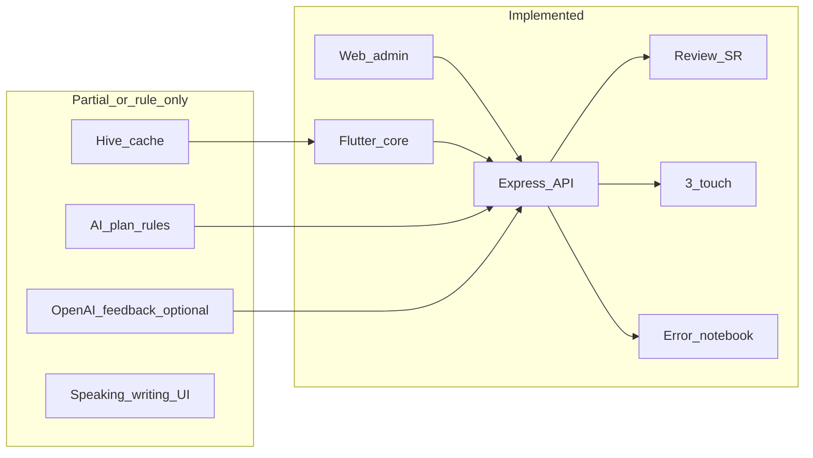

# So sánh tài liệu `doc/` với codebase MY LEARN E

Tài liệu này đối chiếu các mô tả trong thư mục `doc/` với trạng thái thực tế của monorepo (backend, web-admin, mobile-app, database).

**Nguồn tham chiếu trong `doc/`:**  
[MY LEARN E open-source personal project.md](MY%20LEARN%20E%20open-source%20personal%20project.md),  
[kế hoạch dự án app học tiếng Anh cá nhân.md](kế%20hoạch%20dự%20án%20app%20học%20tiếng%20Anh%20cá%20nhân.md),  
[FULL EXPRESS BACKEND.md](FULL%20EXPRESS%20BACKEND.md),  
[FULL DATABASE PRODUCTION VERSION.md](FULL%20DATABASE%20PRODUCTION%20VERSION.md),  
[REVIEW ENGINE như Anki + Quizlet nhưng tối ưu cho người Việt.md](REVIEW%20ENGINE%20như%20Anki%20%2B%20Quizlet%20nhưng%20tối%20ưu%20cho%20người%20Việt.md),  
[FULL AI PERSONAL LEARNING ENGINE.md](FULL%20AI%20PERSONAL%20LEARNING%20ENGINE.md),  
[FULL REACT ADMIN UI production.md](FULL%20REACT%20ADMIN%20UI%20production.md),  
[FULL MOBILE LEARNING FLOW bằng Flutter.md](FULL%20MOBILE%20LEARNING%20FLOW%20bằng%20Flutter.md).

**Đối chiếu chính với code:** `backend/src/app.js`, routes/services/models, `database/migrations`, `web-admin/src`, `mobile-app/lib`.

---

## Đã có (đã có trong code, có thể dùng được)

### Nền tảng và API

- Express + Sequelize + MySQL; cấu trúc controller → service → repository.
- JWT auth; các route học tập dùng `authMiddleware` (`backend/src/app.js`).
- OpenAPI/Swagger tại `/api/docs` và `/api/openapi.json`.
- Health check `/health`.

### Từ vựng và nội dung

- CRUD vocabulary, gắn topic qua `topic_ids`; API collocations và word-family theo `vocabulary/:id` (`backend/src/routes/vocabulary.route.js`).
- CRUD topics (`/api/topics`).
- **`GET /api/topics/today`** — snapshot “nhiệm vụ hôm nay” (gộp rule-based plan + số review đến hạn + top errors); dùng chung cho mobile home/topic (`backend/src/routes/topic.route.js`, `backend/src/services/topic.service.js`).

### Review engine (lõi)

- `GET /api/review/today`, `POST /api/review/submit` với rating Again/Hard/Good/Easy, ease factor, thời gian phản hồi; bảng `review_progress`, `review_history` (`backend/src/constants/review.constants.js`, `backend/src/services/review.service.js`).
- Khoảng cách base 1→120 ngày khớp spec review engine trong doc.

### 3-touch

- `GET/PATCH /api/review/touch/:wordId` và luồng 3 bước trên mobile (`backend/src/routes/review.route.js`, `mobile-app/lib/screens/review/review_screen.dart`).

### Error notebook

- API lỗi + top repeated; tags (migration `add-error-tags`).

### Hoạt động và ưu tiên

- Streak + heatmap API và trang admin (`web-admin/src/pages/StreakPage.jsx`).
- Weak words, confusion pairs (dùng trong AI plan) — theo services/repositories hiện có.
- Cron `node-cron` sinh `daily_review_queue` hằng ngày (`backend/src/jobs/review.job.js`, `backend/src/server.js`).

### AI / engine (rule-based, không LLM)

- `POST /api/ai/generate-today-plan` — kế hoạch ngày bằng rule engine (`meta.llm: false` trong `backend/src/ai/plan-generator.js`).

### Ghi nhận speaking / writing / feedback

- API `speaking-records`, `writing-records`, `ai/feedback` (lưu bản ghi).
- **Tùy chọn LLM:** `POST /api/ai/feedback` với `generate_llm: true` và `learner_text` gọi OpenAI khi có `OPENAI_API_KEY` (`backend/src/services/ai-feedback.service.js`, `backend/src/utils/openai-llm.js`).

### Web admin

- Login, Dashboard (số liệu cơ bản), Vocabulary (**Import CSV** + **Export CSV** — `web-admin/src/pages/VocabularyPage.jsx`), Review, Errors, Topics, Streak, Phase K (speaking/writing/feedback).

### Mobile

- Splash, login, home “Today Mission” (**bind `GET /api/topics/today`** qua `TodayMissionService`), màn topic động, **browse vocabulary** (`/vocabulary`), review + 3-touch (**PageView** + thanh Again–Easy), error notebook, daily summary (Phase K), profile; Hive cache (`mobile-app/lib/services/cache_service.dart`); stub FCM/offline (`push_reminders_stub.dart`, `offline_sync_service.dart`).

### CSDL

- Migration phase B tạo đủ các bảng lõi gần với doc DB production (users, user_settings, topics, vocabulary, maps, review_*, touch_history, error_*, daily_review_queue, v.v.) — xem `database/migrations/20260327100000-create-phase-b-schema.js`.

---

## Chưa có hoặc mới một phần (so với `doc/`)

### Đường dẫn API khác tài liệu cũ

- Doc cũ gợi ý `GET /api/topic/today` (số ít); code dùng **`GET /api/topics/today`** (REST chuẩn dưới resource `topics`). `POST /api/topic` tương ứng **`POST /api/topics`**.

### Flashcard / UX ôn tập (mobile)

- Đã có **PageView** + **4 nút Again–Hard–Good–Easy** + thẻ từ (`review_flashcard.dart`, `review_rating_bar.dart`). **Chưa** có: lật thẻ (flip) ẩn/hiện nghĩa, **vuốt tay** chuyển từ (hiện dùng `NeverScrollableScrollPhysics` — chỉ chuyển trang sau khi chấm điểm), animation như doc minh họa.

### Browse từ (mobile)

- Đã có **danh sách + tìm kiếm** (`screens/vocabulary/vocabulary_list_screen.dart`). **Chưa** có: flashcard browse từng từ, collocations/word-family trong UI (API backend đã có).

### AI theo doc (LLM / Whisper / cá nhân hóa sâu)

- **Đã có (một phần):** gợi ý sửa/ghi nhận qua OpenAI cho `ai/feedback` khi bật `generate_llm` + `OPENAI_API_KEY`.
- **Chưa có:** Whisper/phát âm, sinh chủ đề bằng LLM, recommendation đầy đủ, **knowledge graph**, migration **`ai_error_pattern`** như [FULL AI PERSONAL LEARNING ENGINE.md](FULL%20AI%20PERSONAL%20LEARNING%20ENGINE.md).
- “False master detector” vẫn chỉ **rule** trong plan generator; **chưa** có cột `fake_known_count` trong DB như ví dụ SQL trong doc.

### Tính năng mở rộng trong [kế hoạch dự án app học tiếng Anh cá nhân.md](kế%20hoạch%20dự%20án%20app%20học%20tiếng%20Anh%20cá%20nhân.md)

- Sentence mining; shadowing so sánh giọng; grammar micro 1/ngày; dictation nghe–gõ; heatmap **trên mobile** (admin đã có); speaking recorder chủ đề 30s như sản phẩm hoàn chỉnh — **chưa** hoặc chỉ mức form/ghi nhận (Phase K).

### Hạ tầng “sau này”

- **FCM** nhắc học — mới có **stub** (`mobile-app/lib/services/push_reminders_stub.dart`), chưa tích hợp Firebase.
- **Offline-first sync** toàn phần — mới có Hive + queue review/touch + `OfflineSyncService.pushPendingLearningActions()`; chưa đồng bộ vocabulary hai chiều như doc “self-host/SQLite”.

### CSDL 24 bảng “đầy đủ”

- Doc liệt kê ~24 bảng mở rộng; repo có migration phase B + bổ sung (streak, weak words, AI feedback, v.v.) — cần đối chiếu thủ công nếu muốn khớp **từng** bảng future trong doc (ví dụ một số bảng AI-only có thể chưa tạo).

---

## Gợi ý cách dùng bảng này

- Coi **“đã có”** là phần đã có route + logic chính có thể chạy end-to-end.
- Coi **“chưa / một phần”** là phần doc mô tả nhưng thiếu UI đầy đủ, thiếu LLM/voice, hoặc chỉ placeholder trên mobile.
