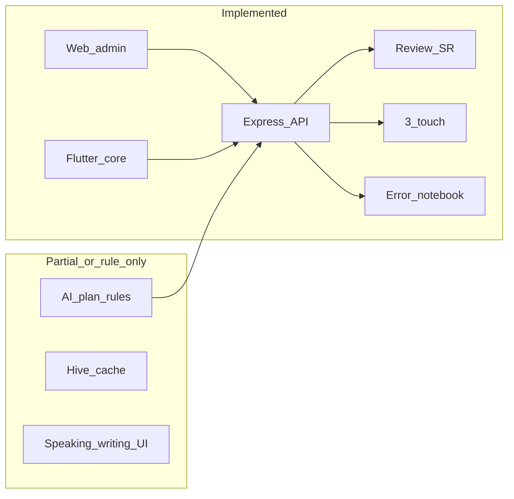

# So sánh tài liệu `doc/` với codebase MY LEARN E

Tài liệu này đối chiếu các mô tả trong thư mục `doc/` với trạng thái thực tế của monorepo (backend, web-admin, mobile-app, database).

**Nguồn tham chiếu trong `doc/`:**  
[MY LEARN E open-source personal project.md](MY%20LEARN%20E%20open-source%20personal%20project.md),  
[kế hoạch dự án app học tiếng Anh cá nhân.md](kế%20hoạch%20dự%20án%20app%20học%20tiếng%20Anh%20cá%20nhân.md),  
[FULL EXPRESS BACKEND.md](FULL%20EXPRESS%20BACKEND.md),  
[FULL DATABASE PRODUCTION VERSION.md](FULL%20DATABASE%20PRODUCTION%20VERSION.md),  
[REVIEW ENGINE như Anki + Quizlet nhưng tối ưu cho người Việt.md](REVIEW%20ENGINE%20như%20Anki%20%2B%20Quizlet%20nhưng%20tối%20ưu%20cho%20người%20Việt.md),  
[FULL AI PERSONAL LEARNING ENGINE.md](FULL%20AI%20PERSONAL%20LEARNING%20ENGINE.md),  
[FULL REACT ADMIN UI production.md](FULL%20REACT%20ADMIN%20UI%20production.md),  
[FULL MOBILE LEARNING FLOW bằng Flutter.md](FULL%20MOBILE%20LEARNING%20FLOW%20bằng%20Flutter.md).

**Đối chiếu chính với code:** `backend/src/app.js`, routes/services/models, `database/migrations`, `web-admin/src`, `mobile-app/lib`.

---

## Đã có (đã có trong code, có thể dùng được)

### Nền tảng và API

- Express + Sequelize + MySQL; cấu trúc controller → service → repository.
- JWT auth; các route học tập dùng `authMiddleware` (`backend/src/app.js`).
- OpenAPI/Swagger tại `/api/docs` và `/api/openapi.json`.
- Health check `/health`.

### Từ vựng và nội dung

- CRUD vocabulary, gắn topic qua `topic_ids`; API collocations và word-family theo `vocabulary/:id` (`backend/src/routes/vocabulary.route.js`).
- CRUD topics (`/api/topics`).

### Review engine (lõi)

- `GET /api/review/today`, `POST /api/review/submit` với rating Again/Hard/Good/Easy, ease factor, thời gian phản hồi; bảng `review_progress`, `review_history` (`backend/src/constants/review.constants.js`, `backend/src/services/review.service.js`).
- Khoảng cách base 1→120 ngày khớp spec review engine trong doc.

### 3-touch

- `GET/PATCH /api/review/touch/:wordId` và luồng 3 bước trên mobile (`backend/src/routes/review.route.js`, `mobile-app/lib/screens/review/review_screen.dart`).

### Error notebook

- API lỗi + top repeated; tags (migration `add-error-tags`).

### Hoạt động và ưu tiên

- Streak + heatmap API và trang admin (`web-admin/src/pages/StreakPage.jsx`).
- Weak words, confusion pairs (dùng trong AI plan) — theo services/repositories hiện có.
- Cron `node-cron` sinh `daily_review_queue` hằng ngày (`backend/src/jobs/review.job.js`, `backend/src/server.js`).

### AI / engine (rule-based, không LLM)

- `POST /api/ai/generate-today-plan` — kế hoạch ngày bằng rule engine (`meta.llm: false` trong `backend/src/ai/plan-generator.js`).

### Ghi nhận speaking / writing / feedback

- API `speaking-records`, `writing-records`, `ai/feedback` (lưu bản ghi; feedback là nội dung client gửi lên, không tự sinh bởi model trong service).

### Web admin

- Login, Dashboard (số liệu cơ bản), Vocabulary (kèm **Import CSV** — `web-admin/src/pages/VocabularyPage.jsx`), Review, Errors, Topics, Streak, Phase K (speaking/writing/feedback).

### Mobile

- Splash, login, home “Today Mission”, review + 3-touch, error notebook, daily summary (Phase K), profile; `mobile-app/lib/services/cache_service.dart` dùng Hive cho cache/offline nhẹ.

### CSDL

- Migration phase B tạo đủ các bảng lõi gần với doc DB production (users, user_settings, topics, vocabulary, maps, review_*, touch_history, error_*, daily_review_queue, v.v.) — xem `database/migrations/20260327100000-create-phase-b-schema.js`.

---

## Chưa có hoặc mới một phần (so với `doc/`)

### Khác endpoint / thiếu “today topic” API

- Doc gợi ý `GET /api/topic/today` và `POST /api/topic`; code hiện có CRUD `/api/topics` nhưng **không** có endpoint “topic hôm nay” riêng (`backend/src/routes/topic.route.js`).

### Import/export

- **Import CSV** có trên admin; **export** dữ liệu (CSV/backup) **chưa** thấy trong `web-admin/src/pages/VocabularyPage.jsx`.

### Flashcard / UI học đầy đủ

- Doc mô tả flashcard flip, swipe `PageView`, 4 nút Again–Easy ở mobile; review screen hiện có luồng submit/rating và 3-touch nhưng **chưa** khớp hết mô tả UI “flashcard trung tâm + swipe” trong [FULL MOBILE LEARNING FLOW bằng Flutter.md](FULL%20MOBILE%20LEARNING%20FLOW%20bằng%20Flutter.md).
- Trong doc có thư mục `screens/vocabulary/` cho flashcard browse; **không** có màn vocabulary/flashcard riêng tương ứng trong `mobile-app/lib/screens`.

### Màn “One Topic Today” trên mobile

- `mobile-app/lib/screens/topic/topic_screen.dart` vẫn **nội dung tĩnh**; không lấy từ `generate-today-plan` hay topics API.

### Home mobile

- `mobile-app/lib/screens/home/home_screen.dart` dùng số **cố định** cho new words / top errors và topic chữ “Daily Communication”, chưa bind đầy đủ API thật.

### AI theo doc (LLM / Whisper / cá nhân hóa sâu)

- Doc Phase 2–3: sentence correction, pronunciation feedback, topic generation, recommendation, knowledge graph — **chưa** có tích hợp LLM/Whisper trong backend; `ai_feedback` chỉ lưu trữ; không có bảng `ai_error_pattern` như mô tả dài trong [FULL AI PERSONAL LEARNING ENGINE.md](FULL%20AI%20PERSONAL%20LEARNING%20ENGINE.md).
- “False master detector” có **logic rule** trong plan generator, không có trường `fake_known_count` riêng như doc SQL mẫu.

### Tính năng mở rộng trong [kế hoạch dự án app học tiếng Anh cá nhân.md](kế%20hoạch%20dự%20án%20app%20học%20tiếng%20Anh%20cá%20nhân.md)

- Sentence mining; shadowing so sánh giọng; grammar micro 1/ngày; dictation nghe–gõ; heatmap **trên mobile** (admin đã có); speaking recorder chủ đề 30s như sản phẩm hoàn chỉnh — **chưa** hoặc chỉ mức form/ghi nhận.

### Hạ tầng “sau này”

- FCM nhắc học; offline-first sync toàn phần; SQLite/self-host như một số gợi ý trong doc — **chưa** (Hive mới hỗ trợ cache/patch tức thời).

### CSDL 24 bảng “đầy đủ”

- Doc liệt kê ~24 bảng mở rộng; repo có migration phase B + bổ sung (streak, weak words, AI feedback, v.v.) — cần đối chiếu thủ công nếu muốn khớp **từng** bảng future trong doc (ví dụ một số bảng AI-only có thể chưa tạo).

---

## Gợi ý cách dùng bảng này

- Coi **“đã có”** là phần đã có route + logic chính có thể chạy end-to-end.
- Coi **“chưa / một phần”** là phần doc mô tả nhưng thiếu UI đầy đủ, thiếu LLM/voice, hoặc chỉ placeholder trên mobile.
